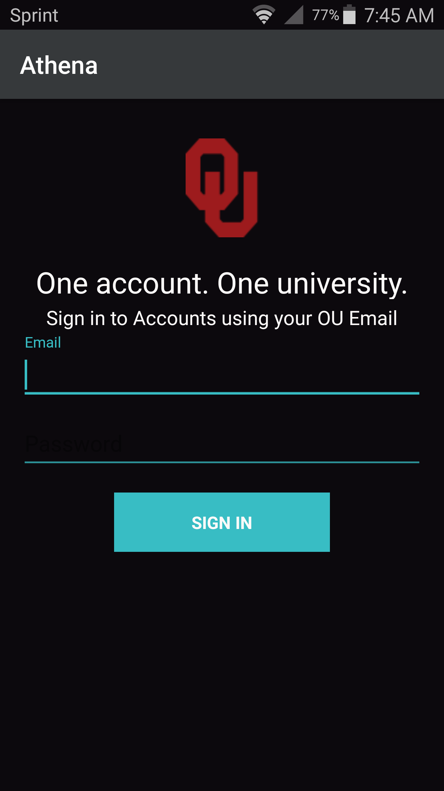
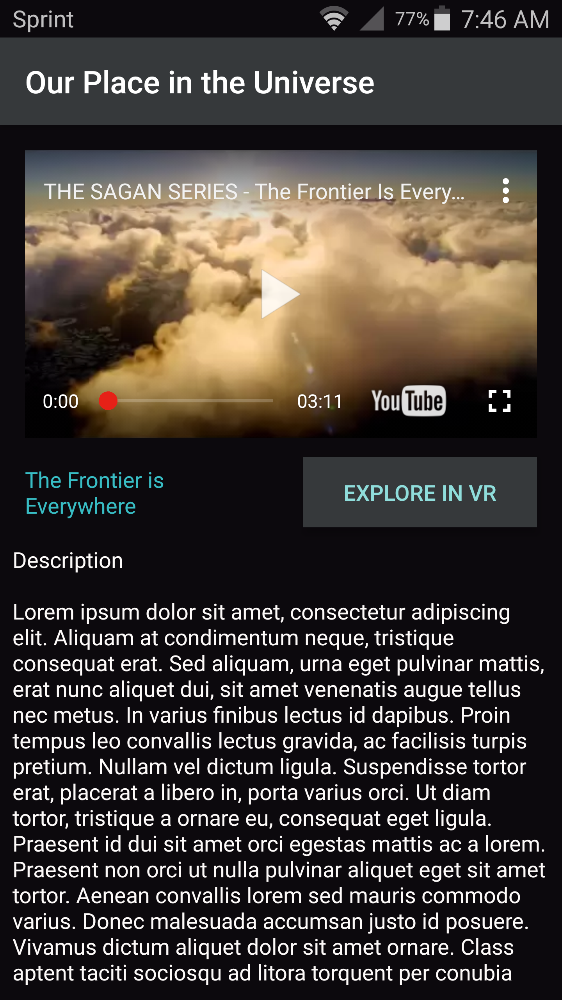
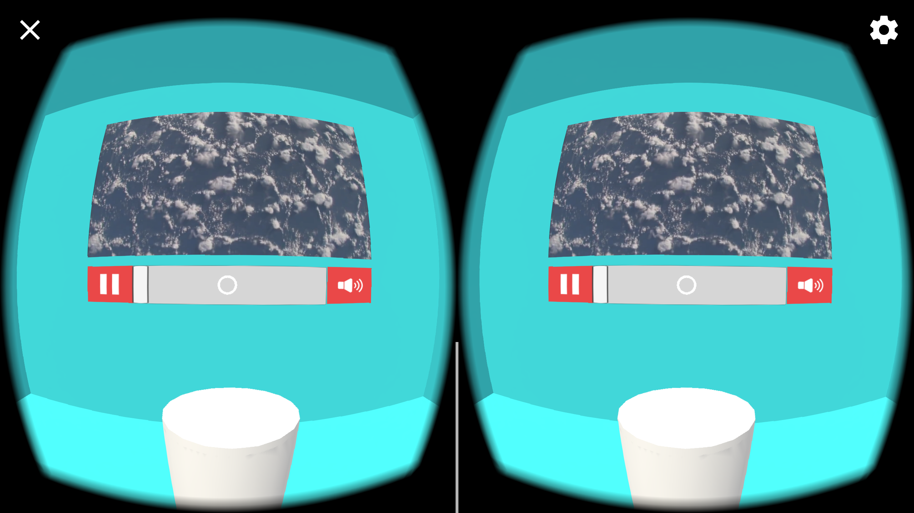
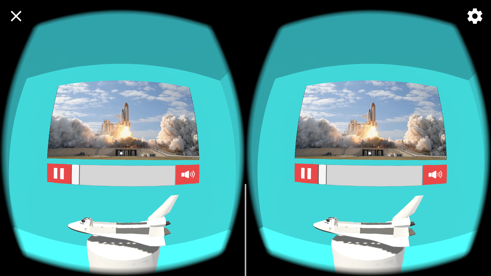
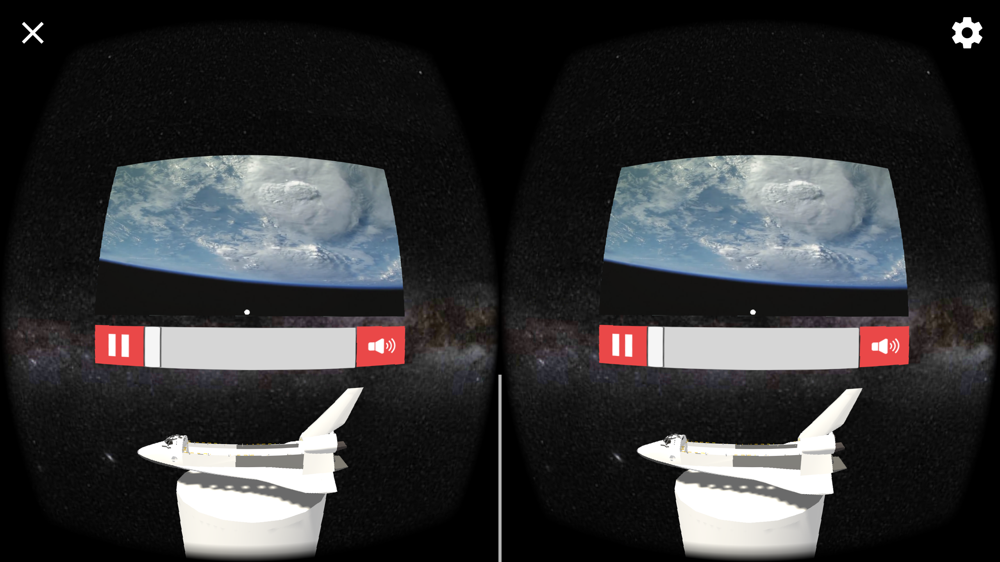

# Athena

### Inspiration
As virtual reality developers, we saw a major lack of vr educational platforms. We want to set a standard for this new and emerging technology!

### What it does
Athena is a mobile learning management system that focuses on virtual reality.

  
  

 

### What's next for Athena
AR and Networking! Students will soon be able engage with their professor's and their peers.

### [Try it out!](http://getathena.io)
